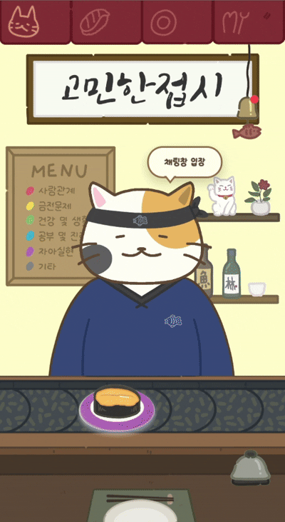
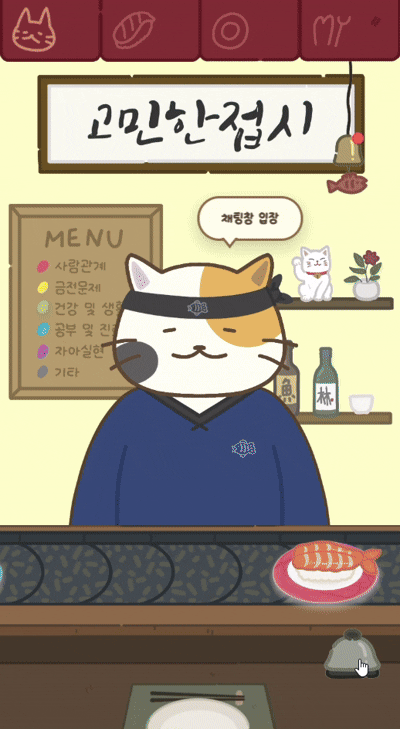
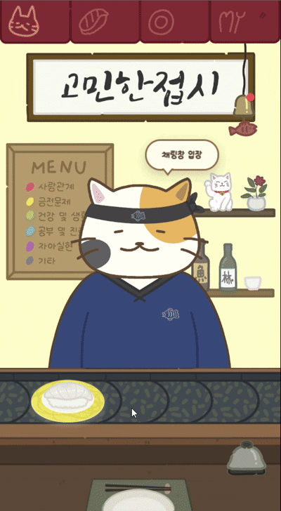
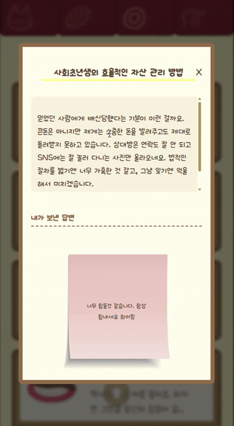
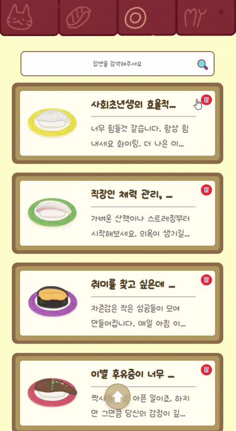
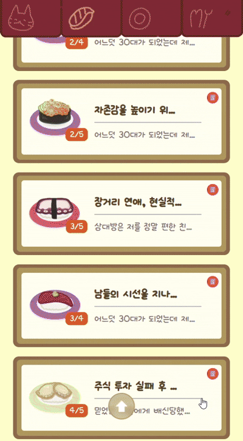
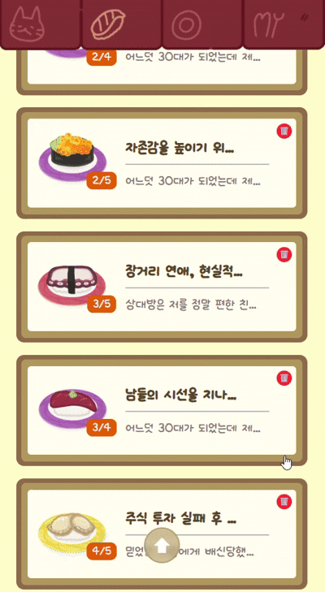
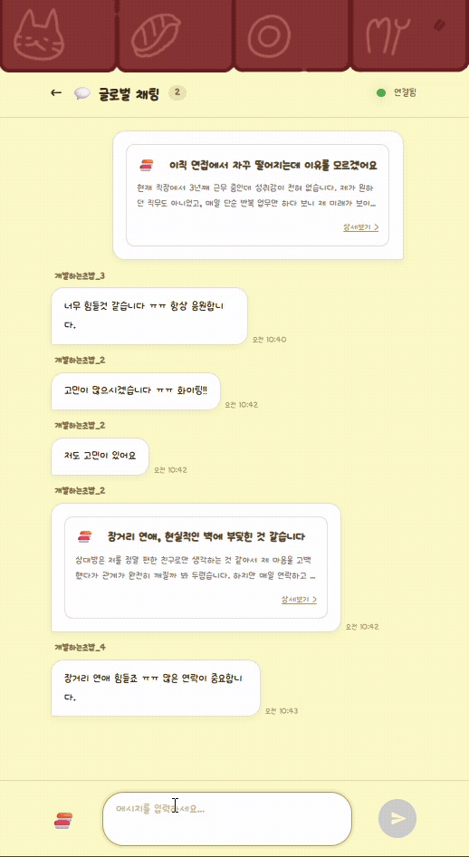
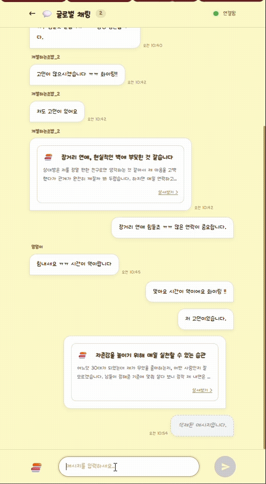
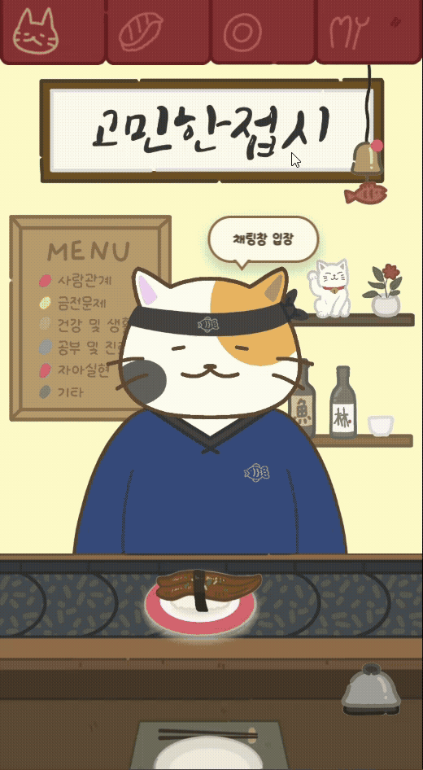

# 🍣 고민한접시 - GominRefactor

> **모두의 고민을 따뜻한 초밥 한 접시에 담아 나누는 소셜 플랫폼**
> 
> 회전초밥집의 따뜻한 분위기 속에서 당신의 고민을 익명으로 나누고, 다른 사람들의 진심 어린 조언을 받아보세요.

---

## 🍱 프로젝트 개요

`GominRefactor`는 기존의 '고민초밥' 서비스를 현대적인 기술 스택으로 리팩토링하고 기능을 확장한 프로젝트입니다. 사용자는 자신의 고민을 '초밥' 형태로 레일(피드)에 올릴 수 있으며, 다른 사용자들은 그 초밥을 선택해 '답변(생강/간장/와사비 등)'을 남길 수 있습니다.

### ✨ 주요 특징
- **🍣 회전초밥 테마의 유니크한 UI**: 고민들이 레일 위에서 움직이며 시각적인 재미를 제공합니다.
- **🛡️ 익명성 보장**: 카카오/구글 로그인을 통해 간편하게 가입하지만, 모든 고민 공유는 익명으로 안전하게 이루어집니다.
- **💬 실시간 소통**: Socket.io를 활용한 실시간 채팅을 통해 초밥(고민)을 공유하고 대화할 수 있습니다.
- **🔔 스마트 알림**: 내 초밥에 답변이 달리면 즉시 알림을 받고 확인할 수 있습니다.
- **🔗 간편한 공유**: 토큰 기반의 공유 링크를 생성하여 외부에서도 특정 고민을 확인할 수 있습니다.

---

## 🎬 데모 GIF

<p align="center">
  
</p>

<div align="center">
  
  
</div>

<div align="center">
  
  
</div>

<div align="center">
  
  
</div>

<div align="center">
  
  
</div>

<div align="center">
  
  
</div>

---

## 🛠️ 기술 스택

### Frontend
- **Framework**: React 19, TypeScript
- **Build Tool**: Vite
- **State Management**: TanStack Query (React Query)
- **Animation**: React Spring
- **Real-time**: Socket.io-client
- **Router**: React Router 7

### Backend
- **Runtime**: Node.js
- **Framework**: Express 5
- **ORM**: Prisma
- **Database**: MySQL
- **Real-time**: Socket.io
- **API Documentation**: Swagger (OpenAPI 3.0)

---

## 📂 프로젝트 구조

```text
gominrefactor/
├── client/              # 프론트엔드 (React + Vite)
│   └── frontend/
│       ├── src/
│       │   ├── component/ # 공통 UI 컴포넌트
│       │   ├── pages/     # 페이지 단위 컴포넌트
│       │   ├── hooks/     # 커스텀 훅 (API 호출 및 로직)
│       │   ├── assets/    # 이미지, 사운드, 폰트 리소스
│       │   └── styles/    # CSS 스타일시트
├── server/              # 백엔드 (Express + Prisma)
│   └── backend/
│       ├── src/
│       │   ├── routes/    # API 엔드포인트 정의
│       │   ├── services/  # 비즈니스 로직
│       │   ├── socket/    # 소켓 이벤트 핸들러
│       │   └── prisma/    # 데이터베이스 스키마 및 마이그레이션
└── README.md            # 프로젝트 메인 문서
```

---

## 🚀 시작하기

프로젝트를 로컬 시스템에서 실행하려면 아래 단계를 따르세요.

### 1️⃣ 필수 요소
- Node.js 18+
- MySQL Server

### 2️⃣ 저장소 클론 및 패키지 설치
```bash
git clone https://github.com/sangholee235/gominrefactor.git
cd gominrefactor
```

### 3️⃣ 서버 설정 (Backend)
```bash
cd server/backend
npm install
# .env 파일 생성 및 설정 (DATABASE_URL 등)
npx prisma generate
npm run dev
```

### 4️⃣ 클라이언트 설정 (Frontend)
```bash
cd client/frontend
npm install
# .env 파일 생성 및 설정 (VITE_API_URL 등)
npm run dev
```

---

## 🏗️ 시스템 아키텍처

<p align="center">
  
  <br>
  <em>고민한접시 시스템 아키텍처</em>
</p>

### 아키텍처 구성 요소

#### 📱 프론트엔드 (Client)
- **React 19 + TypeScript**: 모던한 UI 컴포넌트 기반 개발
- **Vite**: 빠른 개발 서버 및 빌드 도구
- **React Router**: SPA 라우팅 관리
- **TanStack Query**: 서버 상태 관리 및 캐싱
- **Socket.io-client**: 실시간 통신

#### 🚀 백엔드 (Server) 
- **Express.js**: RESTful API 서버
- **Socket.io**: 실시간 웹소켓 통신
- **Prisma**: 타입 안전한 데이터베이스 ORM
- **MySQL**: 관계형 데이터베이스
- **JWT**: 토큰 기반 인증

#### 🔄 데이터 흐름
1. **클라이언트 요청**: React → Express API
2. **실시간 통신**: Socket.io 웹소켓 연결
3. **데이터 처리**: Prisma → MySQL
4. **인증**: JWT 토큰 검증
5. **응답**: JSON 데이터 반환

### 🛡️ 보안 아키텍처
- **CORS**: 도메인 간 요청 제어
- **Helmet**: 보안 헤더 자동 설정
- **Rate Limiting**: API 요청 제한
- **Environment Variables**: 민감정보 보호

## 📖 API 문서

서버 실행 후 아래 주소에서 Swagger UI를 통해 상세한 API 명세를 확인할 수 있습니다.
- **API Docs**: `http://localhost:3000/api-docs` (기본 포트 기준)

---

## 🤝 기여 방법

1. 프로젝트를 포크(Fork)합니다.
2. 기능 구현을 위한 브랜치를 생성합니다 (`git checkout -b feature/AmazingFeature`).
3. 변경 사항을 커밋합니다 (`git commit -m 'Add some AmazingFeature'`).
4. 브랜치에 푸시합니다 (`git push origin feature/AmazingFeature`).
5. 풀 리퀘스트(Pull Request)를 보냅니다.

---
© 2026 Gomin Sushi Team. All rights reserved.
